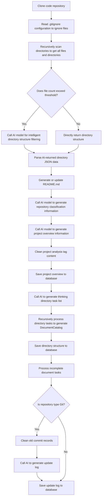

# OpenDeepWiki

AI-driven Code Knowledge Base


### Features
- **Quick Conversion**: Convert all code repositories (GitHub, GitLab, Gitee, Gitea, etc.) into knowledge bases within minutes.
- **Multi-language Support**: Analyze and generate documentation for all programming languages.
- **Code Structure Diagrams**: Automatically generate Mermaid diagrams to help understand code structure.
- **Custom Model Support**: Support for custom models and APIs for flexible extension.
- **AI Intelligent Analysis**: AI-based code analysis and relationship understanding.
- **SEO Friendly**: Generates SEO-friendly documentation and knowledge bases based on Next.js.
- **Conversational Interaction**: Chat with AI to get detailed code information and usage.

### Feature List
- [x] Multiple code repositories (GitHub, GitLab, Gitee, Gitea, etc.)
- [x] Multiple programming languages (Python, Java, C#, JavaScript, etc.)
- [x] Repository management (CRUD)
- [x] Multiple AI providers (OpenAI, AzureOpenAI, Anthropic, etc.)
- [x] Multiple databases (SQLite, PostgreSQL, SqlServer, MySQL, etc.)
- [x] Multiple languages (Chinese, English, French, etc.)
- [x] Upload ZIP and local files
- [x] Data fine-tuning platform
- [x] Directory-level repository management
- [x] Repository directory modification
- [x] User management (CRUD)
- [x] User permission management
- [x] Generate fine-tuning datasets for different frameworks

---

### Project Introduction

OpenDeepWiki is an open-source project inspired by [DeepWiki](https://deepwiki.com/), developed with .NET 9 and Semantic Kernel. It helps developers better understand and utilize code repositories, providing code analysis, documentation generation, and knowledge graph construction.

Main features:
- Analyze code structure
- Understand repository core concepts
- Generate code documentation
- Automatically generate README.md for code
- Support MCP (Model Context Protocol)

---

### MCP Support

OpenDeepWiki supports the MCP protocol:
- Can serve as a single repository MCPServer for repository analysis.

Example configuration:
```json
{
  "mcpServers": {
    "OpenDeepWiki":{
      "url": "http://Your OpenDeepWiki service IP:port/sse?owner=AIDotNet&name=OpenDeepWiki"
    }
  }
}
```
- owner: Repository organization or owner name
- name: Repository name

After adding the repository, you can test by asking questions like "What is OpenDeepWiki?", as shown below:


This way, OpenDeepWiki can serve as an MCPServer for other AI models to call, facilitating analysis and understanding of open-source projects.

---

### 🚀 Quick Start

1. Clone the repository
```bash
git clone https://github.com/AIDotNet/OpenDeepWiki.git
cd OpenDeepWiki
```

2. Modify environment variables in `docker-compose.yml`:
- OpenAI example:
```yaml
services:
  koalawiki:
    environment:
      - KOALAWIKI_REPOSITORIES=/repositories
      - TASK_MAX_SIZE_PER_USER=5 # Maximum parallel document generation tasks per user for AI
      - CHAT_MODEL=DeepSeek-V3 # Model must support function calling
      - ANALYSIS_MODEL= # Analysis model for generating repository directory structure
      - CHAT_API_KEY= # Your API Key
      - LANGUAGE= # Default generation language, e.g., "Chinese"
      - ENDPOINT=https://api.token-ai.cn/v1
      - DB_TYPE=sqlite
      - MODEL_PROVIDER=OpenAI # Model provider, supports OpenAI, AzureOpenAI, Anthropic
      - DB_CONNECTION_STRING=Data Source=/data/KoalaWiki.db
      - EnableSmartFilter=true # Whether to enable smart filtering, affects AI's ability to get repository file directories
      - UPDATE_INTERVAL # Repository incremental update interval in days
      - MAX_FILE_LIMIT=100 # Maximum upload file limit in MB
      - DEEP_RESEARCH_MODEL= # Deep research model, if empty uses CHAT_MODEL
      - ENABLE_INCREMENTAL_UPDATE=true # Whether to enable incremental updates
      - ENABLE_CODED_DEPENDENCY_ANALYSIS=false # Whether to enable code dependency analysis, may affect code quality
      - ENABLE_WAREHOUSE_COMMIT=true # Whether to enable warehouse commit
      - ENABLE_FILE_COMMIT=true # Whether to enable file commit
      - REFINE_AND_ENHANCE_QUALITY=true # Whether to refine and enhance quality
      - ENABLE_WAREHOUSE_FUNCTION_PROMPT_TASK=true # Whether to enable warehouse function prompt task
      - ENABLE_WAREHOUSE_DESCRIPTION_TASK=true # Whether to enable warehouse description task
      - CATALOGUE_FORMAT=compact # Directory structure format (compact, json, pathlist, unix)
      - ENABLE_CODE_COMPRESSION=false # Whether to enable code compression
```
- AzureOpenAI and Anthropic configurations are similar, just adjust `ENDPOINT` and `MODEL_PROVIDER`.

### Database Configuration
#### SQLite (Default)
```yaml
- DB_TYPE=sqlite
- DB_CONNECTION_STRING=Data Source=/data/KoalaWiki.db
```
#### PostgreSQL
```yaml
- DB_TYPE=postgres
- DB_CONNECTION_STRING=Host=localhost;Database=KoalaWiki;Username=postgres;Password=password
```
#### SQL Server
```yaml
- DB_TYPE=sqlserver
- DB_CONNECTION_STRING=Server=localhost;Database=KoalaWiki;Trusted_Connection=true;
```
#### MySQL
```yaml
- DB_TYPE=mysql
- DB_CONNECTION_STRING=Server=localhost;Database=KoalaWiki;Uid=root;Pwd=password;
```

---

### How It Works

OpenDeepWiki leverages AI to:
- Clone code repository locally
- Read .gitignore configuration to ignore irrelevant files
- Recursively scan directories to get all files and directories
- Determine if file count exceeds threshold; if so, call AI model for intelligent directory filtering
- Parse AI-returned directory JSON data
- Generate or update README.md
- Call AI model to generate repository classification information and project overview
- Clean project analysis tag content and save project overview to database
- Call AI to generate thinking directory (task list)
- Recursively process directory tasks to generate document directory structure
- Save directory structure to database
- Process incomplete document tasks
- If Git repository, clean old commit records, call AI to generate update log and save

---

### OpenDeepWiki Repository Parsing to Documentation Detailed Flow Chart



---

### Advanced Configuration
#### Environment Variables
- `KOALAWIKI_REPOSITORIES`: Repository storage path
- `TASK_MAX_SIZE_PER_USER`: Maximum parallel document generation tasks per user for AI
- `CHAT_MODEL`: Chat model (must support function calling)
- `ENDPOINT`: API endpoint
- `ANALYSIS_MODEL`: Analysis model for generating repository directory structure
- `CHAT_API_KEY`: API key
- `LANGUAGE`: Document generation language
- `DB_TYPE`: Database type, supports sqlite, postgres, sqlserver, mysql (default: sqlite)
- `MODEL_PROVIDER`: Model provider, default OpenAI, supports AzureOpenAI, Anthropic
- `DB_CONNECTION_STRING`: Database connection string
- `EnableSmartFilter`: Whether to enable smart filtering, affects AI's ability to get repository directories
- `UPDATE_INTERVAL`: Repository incremental update interval (days)
- `MAX_FILE_LIMIT`: Maximum upload file limit (MB)
- `DEEP_RESEARCH_MODEL`: Deep research model, if empty uses CHAT_MODEL
- `ENABLE_INCREMENTAL_UPDATE`: Whether to enable incremental updates
- `ENABLE_CODED_DEPENDENCY_ANALYSIS`: Whether to enable code dependency analysis, may affect code quality
- `ENABLE_WAREHOUSE_COMMIT`: Whether to enable warehouse commit
- `ENABLE_FILE_COMMIT`: Whether to enable file commit
- `REFINE_AND_ENHANCE_QUALITY`: Whether to refine and enhance quality
- `ENABLE_WAREHOUSE_FUNCTION_PROMPT_TASK`: Whether to enable warehouse function prompt task
- `ENABLE_WAREHOUSE_DESCRIPTION_TASK`: Whether to enable warehouse description task
- `CATALOGUE_FORMAT`: Directory structure format (compact, json, pathlist, unix)
- `ENABLE_CODE_COMPRESSION`: Whether to enable code compression
